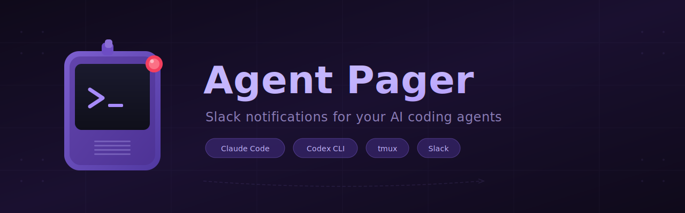

<p align="center">
  
</p>

<p align="center">
  <strong>Get Slack notifications when your AI coding agent needs attention.<br/>Reply from your phone. Walk away from your computer.</strong>
</p>

Agent Pager runs your coding agents ([Claude Code](https://docs.anthropic.com/en/docs/claude-code), [Codex CLI](https://github.com/openai/codex)) inside tmux, captures terminal screenshots when they pause for input, and sends them to Slack. You reply in the Slack thread; your reply goes straight to the agent's terminal.

```
You                    Your Machine                      Slack
─────────────────────────────────────────────────────────────────
page "fix the auth bug"
  └──→ tmux session ──→ claude runs ──→ needs input
                                           │
                                     Agent Pager captures
                                     terminal screenshot
                                           │
                                           └──────────→ DM with screenshot
                                                            │
                                                       You reply: "yes, use JWT"
                                                            │
                                     tmux receives ←────────┘
                                     agent continues
```

## Platform support

| Platform | Status | Screenshots | Reply from Slack |
|----------|--------|-------------|-----------------|
| **macOS** | Full support | Yes (freeze + tmux) | Yes (tmux send-keys) |
| **Linux** | Full support | Yes (freeze + tmux) | Yes (tmux send-keys) |
| **Windows (native)** | Notifications only | No | No |
| **Windows (WSL)** | Full support | Yes | Yes |

On macOS/Linux, tmux powers screenshots and reply routing. On native Windows, Agent Pager works as a **one-way pager** — your agent notifies you on Slack with the assistant's last message, but you can't reply back from Slack. For full bidirectional support on Windows, use WSL.

## Quick start

**Prerequisites:** macOS or Linux (or [WSL](https://learn.microsoft.com/en-us/windows/wsl/install) on Windows), [Node.js](https://nodejs.org) >= 18, [tmux](https://github.com/tmux/tmux), [freeze](https://github.com/charmbracelet/freeze) (for screenshots)

```sh
# macOS
brew install tmux charmbracelet/tap/freeze

# Ubuntu/Debian (including WSL)
sudo apt install tmux
go install github.com/charmbracelet/freeze@latest  # or: snap install freeze

# Windows → see "Windows setup" section below
```

**1. Clone and install**

```sh
git clone https://github.com/pyyush/agent-pager.git
cd agent-pager
npm install --production
```

**2. Create a Slack app** (one-time, ~2 minutes)

Go to [api.slack.com/apps](https://api.slack.com/apps) and click **Create New App > From an app manifest**. Select your workspace, choose YAML, and paste the contents of [`slack-app-manifest.yml`](slack-app-manifest.yml). Then:

1. **Socket Mode** — Settings > Socket Mode > toggle ON. Create a token named `pager-socket` with scope `connections:write`. Copy the `xapp-...` token.
2. **Install to Workspace** — OAuth & Permissions > Install to Workspace. Copy the `xoxb-...` Bot Token.
3. **Your User ID** — click your profile in Slack > "..." > Copy member ID.

**3. Run setup**

```sh
bash setup.sh
```

The setup wizard detects your platform (macOS / Linux / WSL), installs missing dependencies, configures tokens and hooks, sets up auto-start (launchd on macOS, systemd on Linux), and runs an optional smoke test. Takes about a minute.

**4. Use it**

```sh
source ~/.zshrc          # or ~/.bashrc, or open a new terminal
page "fix the auth bug"  # launches Claude Code in tmux, notifies Slack
```

That's it. You'll get a Slack DM with a terminal screenshot whenever the agent pauses for input. Reply in the thread to send text to the agent.

## How it works

Agent Pager has three parts:

| Part | What it does |
|------|-------------|
| **Hooks** | Shell scripts (bash on macOS/Linux, PowerShell on Windows) that fire when the agent pauses. Claude Code uses stdin; Codex CLI uses argv. Each hook captures the JSON payload and POSTs it to the bridge. |
| **Bridge** (`bridge.js`) | A Node.js process that receives hook events, captures tmux screenshots via `freeze`, uploads them to Slack, and routes Slack thread replies back to tmux. Runs as a background service (launchd on macOS, systemd on Linux). |
| **Shell helpers** (`page.sh`) | Functions you source in your shell to start agents in tmux, list sessions, and check bridge health. |

```
┌─────────────────┐     hook fires     ┌─────────────────┐    Socket Mode    ┌──────────┐
│  Claude Code    │ ──────────────────→ │   bridge.js     │ ←───────────────→ │  Slack   │
│  or Codex CLI   │ ← tmux send-keys ─ │  (localhost)     │ ──────────────→  │  (DMs)   │
│  (in tmux)      │                     │                  │   screenshot      │          │
└─────────────────┘                     └─────────────────┘                   └──────────┘
```

## Terminal commands

Add to your shell by sourcing `page.sh` (setup does this automatically):

```sh
source /path/to/agent-pager/page.sh
```

| Command | Description |
|---------|-------------|
| `page <task>` | Start the default agent with a task |
| `page claude <task>` | Start Claude Code specifically |
| `page codex <task>` | Start Codex CLI specifically |
| `page` | Start the default agent interactively (no task) |
| `pagea` | Attach to a running session (interactive picker if multiple) |
| `pagea codex` | Attach to a Codex session only |
| `pagel` | List all active agent sessions |
| `pageb` | Check bridge health |

The default agent is `claude`. Change it with `PAGER_DEFAULT_AGENT=codex` in your `.env` or shell.

## Slack commands

The Slack app registers a single `/pager` command:

| Command | Description |
|---------|-------------|
| `/pager <task>` | Start the default agent |
| `/pager claude <task>` | Start Claude Code |
| `/pager codex <task>` | Start Codex CLI |
| `/pager list` | List active tmux sessions |
| `/pager screen` | Capture and upload screenshots of all sessions |
| `/pager health` | Bridge diagnostics (Slack status, tmux sessions, freeze, uptime) |

## Configuration

All configuration lives in `.env`:

| Variable | Required | Default | Description |
|----------|----------|---------|-------------|
| `SLACK_BOT_TOKEN` | Yes | — | Bot token (`xoxb-...`) |
| `SLACK_APP_TOKEN` | Yes | — | App-level token (`xapp-...`) |
| `SLACK_USER_ID` | One of these | — | Your Slack user ID (DM mode) |
| `SLACK_CHANNEL_ID` | One of these | — | Channel ID (channel mode) |
| `BRIDGE_SECRET` | No | — | Auth token for hook-to-bridge requests (auto-generated by setup) |
| `BRIDGE_PORT` | No | `7890` | HTTP port for the bridge |
| `PAGER_DEFAULT_AGENT` | No | `claude` | Default agent: `claude` or `codex` |
| `ALLOWED_SLACK_USERS` | No | — | Comma-separated user IDs (empty = allow all) |
| `LOG_LEVEL` | No | `info` | `debug`, `info`, `warn`, or `error` |

## Managing the bridge

The setup wizard installs a background service that keeps the bridge running automatically.

**macOS (launchd)**
```sh
tail -f ~/.agent-pager/pager.log                              # View logs
launchctl kickstart -k gui/$(id -u)/com.agent-pager           # Restart
launchctl unload ~/Library/LaunchAgents/com.agent-pager.plist  # Stop
```

**Linux / WSL (systemd)**
```sh
journalctl --user -u agent-pager -f        # View logs
systemctl --user restart agent-pager       # Restart
systemctl --user stop agent-pager          # Stop
```

**Manual (any platform)**
```sh
npm start
```

## Notification flow

When an agent pauses for input, the notification pipeline tries three methods in order:

1. **Screenshot** — captures the tmux pane with ANSI colors, renders to PNG via `freeze`, uploads to Slack
2. **Text capture** — if `freeze` fails, captures the last 80 lines of terminal text and posts as a code block
3. **Plain text** — if tmux capture fails, posts a simple "needs attention" message

Notifications are debounced (30s per session) to avoid flooding Slack.

## Adding a new agent

Agent Pager uses an adapter pattern. To add support for a new agent, create two files:

**1. `adapters/myagent.js`**

```js
module.exports = {
  name: 'myagent',
  displayName: 'My Agent',
  binary: 'myagent',           // CLI command to run
  launchArgs: ['--auto'],      // flags for unattended operation (optional, default [])
  sessionPrefix: 'ma',         // tmux sessions: ma-<id>
  mapPayload(raw) {            // normalize hook JSON
    return {
      sessionId: raw.id,
      cwd: raw.cwd || '',
      notificationType: raw.event || 'unknown',
    };
  },
};
```

**2. `hooks/myagent/notify.sh`**

```bash
#!/usr/bin/env bash
set -euo pipefail
export AGENT_PAYLOAD=$(cat)    # or "$1" depending on how the agent delivers JSON
export AGENT_NAME="myagent"
source "$(cd "$(dirname "$0")" && pwd)/../shared/post-to-bridge.sh"
post_to_bridge "/notification"
```

The adapter is auto-discovered by the bridge on startup. The `/pager myagent <task>` Slack command works immediately. To also use `page myagent <task>` from the terminal, add a case to `page.sh`.

## Project structure

```
agent-pager/
  bridge.js                    # Main process — Slack bot + HTTP server
  page.sh                      # Shell functions (page, pagea, pagel, pageb)
  setup.sh                     # Setup wizard (macOS/Linux)
  setup-windows.ps1            # Setup wizard (Windows)
  adapters/
    claude.js                  # Claude Code adapter
    codex.js                   # Codex CLI adapter
    index.js                   # Auto-loader + helper functions
  hooks/
    shared/
      detect-tmux.sh           # Finds which tmux session a process is in
      post-to-bridge.sh        # Injects metadata and POSTs to bridge (bash)
      post-to-bridge.ps1       # Same, for Windows (PowerShell)
    claude/
      notify.sh                # Claude Code notification hook (bash)
      stop.sh                  # Claude Code stop hook (bash)
      windows/
        notify.ps1             # Claude Code notification hook (PowerShell)
        stop.ps1               # Claude Code stop hook (PowerShell)
    codex/
      notify.sh                # Codex CLI notification hook (bash)
      windows/
        notify.ps1             # Codex CLI notification hook (PowerShell)
  launchd/
    com.agent-pager.plist      # macOS auto-start template
  slack-app-manifest.yml       # Slack app manifest for one-click creation
  .env.example                 # Configuration template
```

## Linux setup

The setup wizard auto-detects Linux and offers systemd instead of launchd. Just run the same steps as Quick Start:

```sh
git clone https://github.com/pyyush/agent-pager.git
cd agent-pager
npm install --production
bash setup.sh
```

The wizard will:
- Detect your package manager (apt, dnf, pacman) and offer to install missing dependencies
- Set up a systemd user service for auto-start
- Source `page.sh` in your `.bashrc` or `.zshrc`

## Windows setup

### Option A: Native PowerShell (notifications only)

Agent Pager works as a one-way pager on native Windows — your agent notifies Slack with its last message when it needs attention. No screenshots or reply-from-Slack.

```powershell
git clone https://github.com/pyyush/agent-pager.git
cd agent-pager
npm install --production
powershell -ExecutionPolicy Bypass -File setup-windows.ps1
```

Start the bridge in a terminal:

```powershell
node bridge.js
```

Then start your agent in a separate terminal. The hooks fire automatically:

```powershell
claude "fix the auth bug"
codex --full-auto "fix the auth bug"
```

You'll get Slack DMs with the agent's last message when it pauses. To reply, switch back to the agent's terminal window.

### Option B: WSL (full support)

For screenshots and reply-from-Slack, run everything inside WSL:

1. **Install WSL**: `wsl --install` in PowerShell (admin), then restart.

2. **Inside WSL**, install dependencies and run setup:

```sh
sudo apt update && sudo apt install -y tmux curl
# Install Node.js (https://github.com/nodesource/distributions)
# Install freeze: go install github.com/charmbracelet/freeze@latest
# Install your agent(s): claude, codex, etc.

git clone https://github.com/pyyush/agent-pager.git
cd agent-pager
npm install --production
bash setup.sh   # skip the launchd step — use systemd (see Linux setup above)
```

3. **Keep WSL running.** Use systemd or a background tmux session:

```sh
tmux new-session -d -s pager 'node bridge.js'
```

4. **Use it** from inside WSL:

```sh
source ~/.bashrc
page "fix the auth bug"
```

Slack notifications work the same on all platforms — the bridge connects via Socket Mode (outbound WebSocket), so no inbound ports or firewall config needed.

## Security

- The bridge listens only on `127.0.0.1` — no external network access
- Hook requests are authenticated with `BRIDGE_SECRET` (auto-generated during setup)
- The `ALLOWED_SLACK_USERS` allowlist restricts who can issue Slack commands and reply to threads
- Sleep prevention via `caffeinate` is macOS-only (skipped gracefully on Linux/WSL)

## License

MIT
